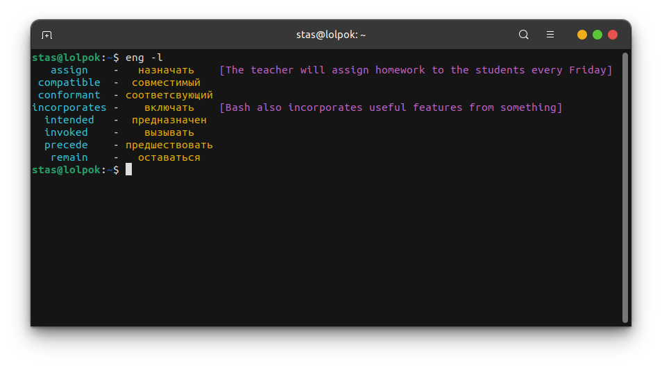
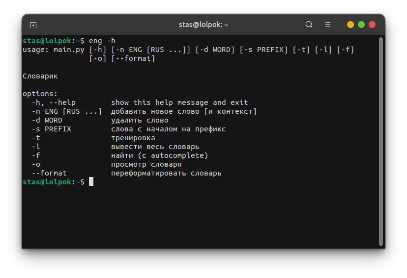
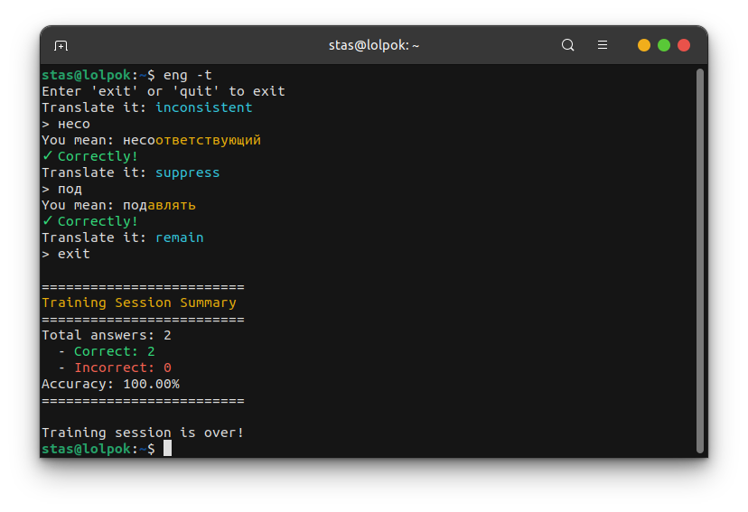
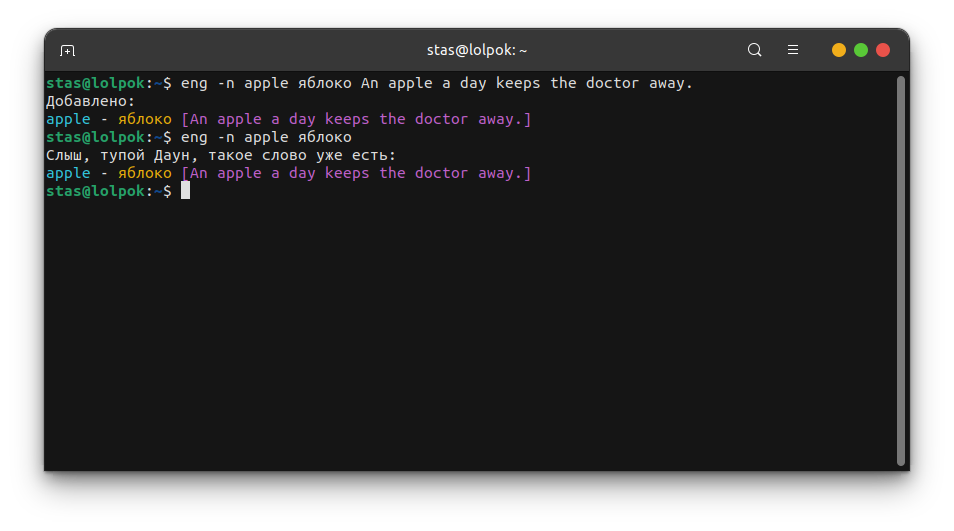

# 😊 English Vocabulary Helper

This is a command line application designed to help you learn new English words! It includes a workout mode that will speed up the memorization process! 🎯

## How it looks?



## 🚀 Features

- **➕ Add New Words**: Easily add new English words and their translations.
- **🗑️ Delete Words**: Remove words from your vocabulary list.
- **✏️ Edit Words**: Update translations or contexts for existing words.
- **📋 List All Words**: View your entire vocabulary dictionary.
- **🔍 Search by Prefix**: Find words that start with a specific prefix.
- **🧠 Training Mode**: Memorize new words as you practice.

## 🤔 How it works?



## 🧠 Smart Training Explained

1. **⏰ Time-based Prioritization**: Words that you haven't seen in a while (or are new) are given a higher priority. This encourages spaced repetition, a proven learning technique where reviewing material at increasing intervals helps long-term retention. 📈
2. **❌ Error-based Weighting**: If you make a mistake on a word during a training session, that word's "error count" increases! Words with higher error counts are given significantly more weight, meaning they are more likely to appear again in the current session. This ensures you repeatedly practice the words you find most challenging until you master them. 💪



After training, the program shows some statistics on the results. For example, she notes the words in which you were most often mistaken, and your accuracy in the answers.

**Note**: Statistics are being accumulated only for the current training session. In each new session, the statistics are reset to zero.

Sometimes the words can be very long and you don't want to write them over and over again. Therefore, an answer is considered correct if its beginning coincides with the beginning of the correct answer.

## 💻 Installation

To install the tool, navigate to the project's root directory and run the `install.sh` script:

```bash
cd /path/to/english
chmod +x install.sh
sudo ./install.sh
```

The installer will:
- ✅ Check for Python 3 and pip3. If pip3 is not found, it will attempt to install it.
- 📦 Install necessary Python dependencies listed in `requirements.txt`.
- 🔗 Create a symlink to the `main.py` in `/usr/local/bin`.

After installation, run `eng` to view the help message. 🎉

## 🗑️ Uninstallation

To uninstall the application, navigate to the project's root directory and run the `uninstall.sh`:

```bash
cd /path/to/english
chmod +x uninstall.sh
sudo ./uninstall.sh
```

The uninstaller will:
- 🔗 Remove the symlink from `/usr/local/bin`.

**Note**: The uninstallation script does NOT remove database! You can manually delete the `eng_vocab.db` file located in the `database/`. 🙌

## ❗If the word already exists



## 🗂️ Project Structure

```r
.
├── database
│   └── eng_vocab.db  <-- vocabulary database
├── install.sh
├── pictures
│   ├── 1.png
│   ├── 2.png
│   ├── 3.png
│   └── 4.png
├── README.md
├── requirements.txt
├── source
│   ├── auxiliary.py
│   ├── constants.py
│   ├── db_rule.py
│   └── main.py
└── uninstall.sh
```

If the database `eng_vocab.db` does not exist when it is first accessed, it will be created automatically.

**PS**: For me, as a novice developer, this thing turned out to be useful. My English level is not up to the level of reading documentation fluently. However, after creating this tool and adding literally 30 unfamiliar words, I began to understand the text without any problems. 👀