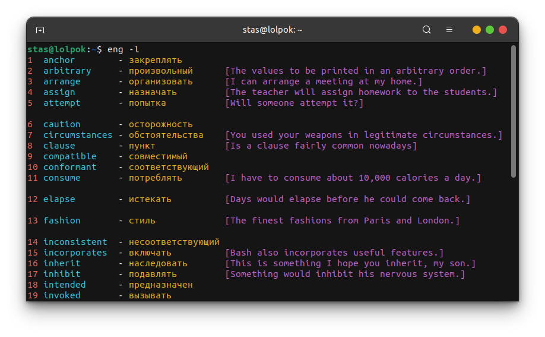
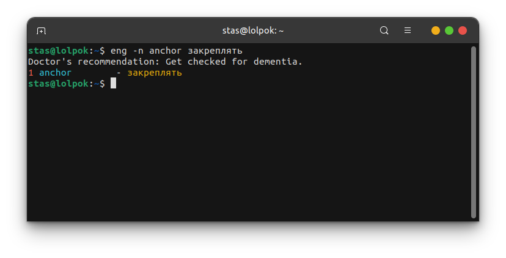

# 📚 English Vocabulary Helper 😊

This is a command-line application designed to help you learn and practice English vocabulary while keeping the mood light and fun! It features a smart training mode that adapts to your learning progress like a personal tutor 🎯

## How does it look?




## 🚀 Features

- **➕ Add New Words**: Easily add new English words, their Russian translations, and optional context sentences!
- **🗑️ Delete Words**: Remove words from your vocabulary list when you're done with them!
- **✏️ Edit Words**: Update translations or contexts for existing words anytime!
- **📋 List All Words**: View your entire vocabulary dictionary in one go!
- **🔍 Search by Prefix**: Find words that start with a specific prefix super fast!
- **🧠 Smart Training Mode**: An intelligent training algorithm helps you focus on words you struggle with most!

## 🤔 How does it work?


## 🧠 Smart Training Explained

The training mode in this application is designed to optimize your learning efficiency while keeping you motivated! It's "smart" because it employs a spaced repetition-like system combined with error-based weighting:

1. **⏰ Time-based Prioritization**: Words that you haven't seen in a while (or are new) are given a higher priority! This encourages spaced repetition, a proven learning technique where reviewing material at increasing intervals helps long-term retention! 📈
2. **❌ Error-based Weighting**: If you make a mistake on a word during a training session, that word's "error count" increases! Words with higher error counts are given significantly more weight, meaning they are more likely to appear again in the current session! This ensures you repeatedly practice the words you find most challenging until you master them! 💪

This combination ensures that the training adapts to your individual learning needs, presenting you with words that you are most likely to forget or have difficulty with, thereby maximizing the effectiveness of your study time! 🌟


## 💻 Installation

To install the application, navigate to the project's root directory and run the `install.sh` script:

```bash
cd /path/to/english-vocabulary-helper
chmod +x install.sh
sudo ./install.sh
```

The installer will:
- ✅ Check for Python 3 and pip3. If pip3 is not found, it will attempt to install it!
- 📦 Install necessary Python dependencies listed in `requirements.txt`!
- 🔗 Create a symlink to the `main.py` script in `/usr/local/bin`!

After installation, please run `source ~/.bashrc` or restart your terminal to apply the new alias! 🎉

## 🗑️ Uninstallation

To uninstall the application, navigate to the project's root directory and run the `uninstall.sh` script:

```bash
cd /path/to/english-vocabulary-helper
chmod +x uninstall.sh
sudo ./uninstall.sh
```

The uninstaller will:
- 🔗 Remove the symlink from `/usr/local/bin`!

**Note**: The uninstallation script does NOT remove your vocabulary database! You can manually delete the `eng_vocab.db` file located in the `database/` directory if you wish to remove your data! 🙌

## ❗If the word already exists



## 🗂️ Project Structure

```r
.
├── database
│   └── eng_vocab.db
├── install.sh
├── pictures
│   ├── 1.png
│   ├── 2.png
│   ├── 3.png
│   └── 4.png
├── README.md
├── requirements.txt
├── source
│   ├── auxiliary.py
│   ├── constants.py
│   ├── db_rule.py
│   └── main.py
└── uninstall.sh
```

**PS**: For me, as a novice developer, this thing turned out to be useful. My English level is not up to the level of reading documentation fluently. However, after creating this tool and adding literally 30 unfamiliar words, I began to understand the text without any problems 👀